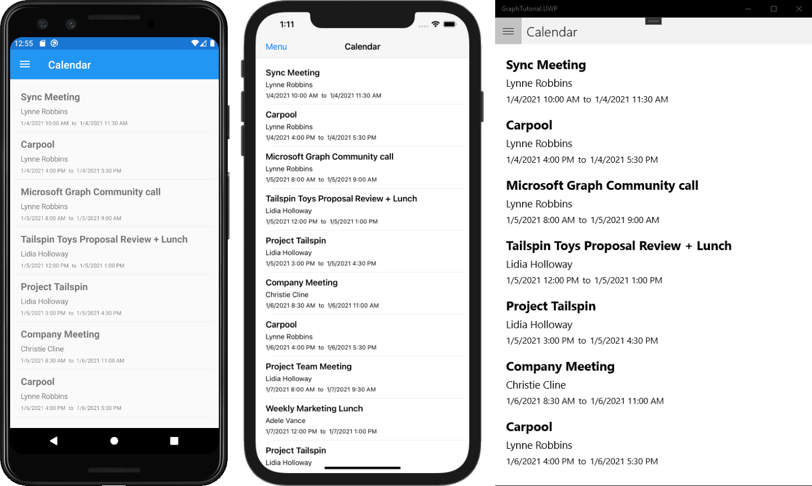

<!-- markdownlint-disable MD002 MD041 -->

<span data-ttu-id="65037-101">En este ejercicio, incorporará Microsoft Graph a la aplicación.</span><span class="sxs-lookup"><span data-stu-id="65037-101">In this exercise you will incorporate the Microsoft Graph into the application.</span></span> <span data-ttu-id="65037-102">Para esta aplicación, usará la [biblioteca de cliente de Microsoft Graph para .net](https://github.com/microsoftgraph/msgraph-sdk-dotnet) para realizar llamadas a Microsoft Graph.</span><span class="sxs-lookup"><span data-stu-id="65037-102">For this application, you will use the [Microsoft Graph Client Library for .NET](https://github.com/microsoftgraph/msgraph-sdk-dotnet) to make calls to Microsoft Graph.</span></span>

## <a name="get-calendar-events-from-outlook"></a><span data-ttu-id="65037-103">Obtener eventos de calendario de Outlook</span><span class="sxs-lookup"><span data-stu-id="65037-103">Get calendar events from Outlook</span></span>

1. <span data-ttu-id="65037-104">Abra **CalendarPage. Xaml** en el proyecto **GraphTutorial** y reemplace su contenido por lo siguiente.</span><span class="sxs-lookup"><span data-stu-id="65037-104">Open **CalendarPage.xaml** in the **GraphTutorial** project and replace its contents with the following.</span></span>

    ```xaml
    <?xml version="1.0" encoding="utf-8" ?>
    <ContentPage xmlns="http://xamarin.com/schemas/2014/forms"
                 xmlns:x="http://schemas.microsoft.com/winfx/2009/xaml"
                 Title="Calendar"
                 x:Class="GraphTutorial.CalendarPage">
        <ContentPage.Content>
            <StackLayout>
                <Editor x:Name="JSONResponse"
                        IsSpellCheckEnabled="False"
                        HorizontalOptions="FillAndExpand"
                        VerticalOptions="FillAndExpand"/>
            </StackLayout>
        </ContentPage.Content>
    </ContentPage>
    ```

1. <span data-ttu-id="65037-105">Abra **CalendarPage.Xaml.CS** y agregue las siguientes `using` instrucciones en la parte superior del archivo.</span><span class="sxs-lookup"><span data-stu-id="65037-105">Open **CalendarPage.xaml.cs** and add the following `using` statements at the top of the file.</span></span>

    ```csharp
    using Microsoft.Graph;
    using Newtonsoft.Json;
    using System.Collections.ObjectModel;
    using System.ComponentModel;
    ```

1. <span data-ttu-id="65037-106">Agregue la siguiente función a la `CalendarPage` clase para obtener los eventos del usuario y mostrar la respuesta de JSON.</span><span class="sxs-lookup"><span data-stu-id="65037-106">Add the following function to the `CalendarPage` class to get the user's events and display the JSON response.</span></span>

    ```csharp
    protected override async void OnAppearing()
    {
        base.OnAppearing();

        // Get the events
        var events = await App.GraphClient.Me.Events.Request()
            .Select(e => new
            {
                e.Subject,
                e.Organizer,
                e.Start,
                e.End
            })
            .OrderBy("createdDateTime DESC")
            .GetAsync();

        // Temporary
        JSONResponse.Text = JsonConvert.SerializeObject(events.CurrentPage, Formatting.Indented);
    }
    ```

    <span data-ttu-id="65037-107">Tenga en cuenta lo que `OnAppearing` hace el código.</span><span class="sxs-lookup"><span data-stu-id="65037-107">Consider what the code in `OnAppearing` is doing.</span></span>

    - <span data-ttu-id="65037-108">La dirección URL a la que se `/v1.0/me/events`llamará es.</span><span class="sxs-lookup"><span data-stu-id="65037-108">The URL that will be called is `/v1.0/me/events`.</span></span>
    - <span data-ttu-id="65037-109">La `Select` función limita los campos devueltos para cada evento a solo aquellos que la vista usará realmente.</span><span class="sxs-lookup"><span data-stu-id="65037-109">The `Select` function limits the fields returned for each events to just those the view will actually use.</span></span>
    - <span data-ttu-id="65037-110">La `OrderBy` función ordena los resultados por la fecha y hora en que se crearon, con el elemento más reciente en primer lugar.</span><span class="sxs-lookup"><span data-stu-id="65037-110">The `OrderBy` function sorts the results by the date and time they were created, with the most recent item being first.</span></span>

1. <span data-ttu-id="65037-111">Ejecute la aplicación, inicie sesión y haga clic en el elemento de navegación **calendario** en el menú.</span><span class="sxs-lookup"><span data-stu-id="65037-111">Run the app, sign in, and click the **Calendar** navigation item in the menu.</span></span> <span data-ttu-id="65037-112">Debería ver un volcado JSON de los eventos en el calendario del usuario.</span><span class="sxs-lookup"><span data-stu-id="65037-112">You should see a JSON dump of the events on the user's calendar.</span></span>

## <a name="display-the-results"></a><span data-ttu-id="65037-113">Mostrar los resultados</span><span class="sxs-lookup"><span data-stu-id="65037-113">Display the results</span></span>

<span data-ttu-id="65037-114">Ahora puede reemplazar el volcado de JSON con algo para mostrar los resultados de forma fácil de uso.</span><span class="sxs-lookup"><span data-stu-id="65037-114">Now you can replace the JSON dump with something to display the results in a user-friendly manner.</span></span>

<span data-ttu-id="65037-115">Para empezar, cree un [convertidor de valores de enlace](/xamarin/xamarin-forms/xaml/xaml-basics/data-binding-basics#binding-value-converters) para convertir los valores de [dateTimeTimeZone](/graph/api/resources/datetimetimezone?view=graph-rest-1.0) devueltos por Microsoft Graph en los formatos de fecha y hora que el usuario espera.</span><span class="sxs-lookup"><span data-stu-id="65037-115">Start by creating a [binding value converter](/xamarin/xamarin-forms/xaml/xaml-basics/data-binding-basics#binding-value-converters) to convert the [dateTimeTimeZone](/graph/api/resources/datetimetimezone?view=graph-rest-1.0) values returned by Microsoft Graph into the date and time formats the user expects.</span></span>

1. <span data-ttu-id="65037-116">Haga clic con el botón derecho en la carpeta **modelos** en el proyecto **GraphTutorial** y seleccione **Agregar**y, a continuación, **clase...**. Asigne un nombre `GraphDateTimeTimeZoneConverter` a la clase y seleccione **Agregar**.</span><span class="sxs-lookup"><span data-stu-id="65037-116">Right-click the **Models** folder in the **GraphTutorial** project and select **Add**, then **Class...**. Name the class `GraphDateTimeTimeZoneConverter` and select **Add**.</span></span>

1. <span data-ttu-id="65037-117">Reemplace todo el contenido del archivo por lo siguiente.</span><span class="sxs-lookup"><span data-stu-id="65037-117">Replace the entire contents of the file with the following.</span></span>

    :::code language="csharp" source="../demo/GraphTutorial/GraphTutorial/Models/GraphDateTimeTimeZoneConverter.cs" id="DateTimeConverterSnippet":::

1. <span data-ttu-id="65037-118">Reemplace todo el contenido de **CalendarPage. Xaml** por lo siguiente.</span><span class="sxs-lookup"><span data-stu-id="65037-118">Replace the entire contents of **CalendarPage.xaml** with the following.</span></span>

    :::code language="xaml" source="../demo/GraphTutorial/GraphTutorial/CalendarPage.xaml":::

    <span data-ttu-id="65037-119">Esto reemplaza `Editor` por un `ListView`.</span><span class="sxs-lookup"><span data-stu-id="65037-119">This replaces the `Editor` with a `ListView`.</span></span> <span data-ttu-id="65037-120">El `DataTemplate` que se usa para representar cada elemento `GraphDateTimeTimeZoneConverter` utiliza el para `Start` convertir `End` las propiedades y del evento en una cadena.</span><span class="sxs-lookup"><span data-stu-id="65037-120">The `DataTemplate` used to render each item uses the `GraphDateTimeTimeZoneConverter` to convert the `Start` and `End` properties of the event to a string.</span></span>

1. <span data-ttu-id="65037-121">Abra **CalendarPage.Xaml.CS** y quite las siguientes líneas de la `OnAppearing` función.</span><span class="sxs-lookup"><span data-stu-id="65037-121">Open **CalendarPage.xaml.cs** and remove the following lines from the `OnAppearing` function.</span></span>

    ```csharp
    // Temporary
    JSONResponse.Text = JsonConvert.SerializeObject(events.CurrentPage, Formatting.Indented);
    ```

1. <span data-ttu-id="65037-122">En su ubicación, agregue el siguiente código.</span><span class="sxs-lookup"><span data-stu-id="65037-122">In their place, add the following code.</span></span>

    ```csharp
    // Add the events to the list view
    CalendarList.ItemsSource = events.CurrentPage.ToList();
    ```

1. <span data-ttu-id="65037-123">Ejecute la aplicación, inicie sesión y haga clic en el elemento de navegación **calendario** .</span><span class="sxs-lookup"><span data-stu-id="65037-123">Run the app, sign in, and click the **Calendar** navigation item.</span></span> <span data-ttu-id="65037-124">Debe ver la lista de eventos con los valores de **Inicio** y **finalización** con formato.</span><span class="sxs-lookup"><span data-stu-id="65037-124">You should see the list of events with the **Start** and **End** values formatted.</span></span>

    
